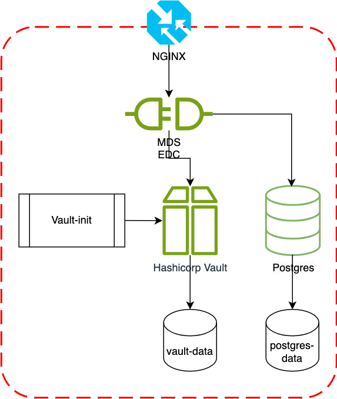

# Deploy the Blueprint MDS EDC Participant Infrastructure with `docker-compose`

## Prerequisites

- Docker and Docker Compose installed on your system
- A domain name (for production use with Let's Encrypt SSL)

## Architecture



The deployment architecture consists of the following components:

1. Nginx: Acts as a reverse proxy and handles SSL/TLS termination. It routes incoming requests to the appropriate services.

2. Certbot: Manages SSL/TLS certificates using Let's Encrypt for HTTPS.

3. MDS EDC: The core component of the MDS (Mobility Data Space) Connector. It handles data exchange, policy enforcement, and integration with other participants in the dataspace.

4. PostgreSQL: Provides persistent storage for the Connector, storing configuration data, policies, and other necessary information.

5. Vault: HashiCorp Vault is used for secure secret management. It stores sensitive information such as API keys, certificates, and passwords, which are then injected into the EDC service.

6. Vault-init: A helper service that initializes and configures the Vault with necessary secrets during deployment.

## Data Persistence and Production Considerations

### Current Setup

The docker-compose configuration is designed as a **quick-start development and testing environment**. Understanding its data persistence characteristics is critical before deploying to production.

#### PostgreSQL Persistence

PostgreSQL is configured with **persistent storage** via Docker named volumes:

```yaml
volumes:
  postgres-data:/var/lib/postgresql/data
```

**What this means:**

- Container restarts **preserve** all data (assets, policies, contracts, transfer history)
- Stopping and starting services with `docker compose down` and `docker compose up` **preserves** data
- Deleting volumes with `docker compose down -v` or `docker volume rm` **destroys all data permanently**

**PostgreSQL data includes:**

- Assets and data addresses
- Policy definitions
- Contract definitions and agreements
- Transfer process state and history

#### Vault Persistence

**IMPORTANT**: Vault is currently running in **development mode** (`command: server -dev`), which has significant limitations:

**Development Mode Characteristics:**

- **Stores all data in memory only** (ignores the volume mount)
- **Runtime secrets created by EDC are lost** on container restart
- **Secrets from init-vault.sh persist** because they are regenerated on every startup
- **Not suitable for production** (auto-unsealed, uses root token, no TLS)

**Which secrets are affected:**

*Persistent (recreated by init-vault.sh):*

- Transfer proxy signing keys
- DAPS certificate and private key
- Any secrets defined in the init script

*Lost on restart (created at runtime):*

- OAuth2 client secrets stored by EDC
- Dynamically created access tokens
- Any secrets created manually via Vault UI
- Runtime-generated keys and credentials

**Production Impact:**
If you restart the Vault container, any OAuth2-protected data sources or runtime-created secrets will stop working until reconfigured. This can cause:

- Failed contract negotiations
- Transfer process failures
- Authentication errors with external services
- Manual reconfiguration required after each restart

### Production Requirements

For a production deployment, the following is **recommended**:

#### 1. Vault Production Configuration

Vault must be reconfigured with:

- **Persistent Storage Backend**: Use Raft integrated storage or Consul
  - [Raft Storage Documentation](https://developer.hashicorp.com/vault/docs/configuration/storage/raft)

- **TLS Enabled**: All communication must be encrypted
  - [TCP Listener with TLS](https://developer.hashicorp.com/vault/docs/configuration/listener/tcp)

- **Proper Seal/Unseal**: Use auto-unseal with cloud KMS (AWS KMS, Azure Key Vault, etc.)
  - [Seal/Unseal Documentation](https://developer.hashicorp.com/vault/docs/configuration/seal)

- **Authentication Methods**: Remove reliance on root token, use AppRole or similar
  - [Auth Methods Documentation](https://developer.hashicorp.com/vault/docs/auth)

See [Production Vault Setup Guide](production_vault_setup.md) for detailed configuration instructions.

#### 2. PostgreSQL Production Setup

- **Regular Backups**: Implement automated backup strategy
  - Use `pg_dump` for logical backups
  - Consider volume snapshots for point-in-time recovery

- **High Availability**: Consider PostgreSQL clustering for critical deployments
  - [PostgreSQL High Availability](https://www.postgresql.org/docs/current/high-availability.html)

- **Monitoring**: Implement health checks and performance monitoring

- **Security**: Use strong passwords, restrict network access, enable SSL connections

See [Backup and Recovery Guide](backup_and_recovery.md) for comprehensive procedures.

### Additional Resources

- [HashiCorp Vault Production Hardening](https://developer.hashicorp.com/vault/tutorials/operations/production-hardening)
- [PostgreSQL Production Checklist](https://www.postgresql.org/docs/current/runtime-config.html)
- [EDC Deployment Best Practices](https://eclipse-edc.github.io/documentation/for-contributors/best-practices/)

## Configuration

1. An `.env.example` file is provided in the project root. This file contains a template for all the necessary environment variables, grouped by their respective components (MDS EDC, DAPS, Postgres, and Vault).

2. Create a `.env` file by copying the `.env.example` file:

   ```bash
   cp .env.example .env
   ```

3. Edit the `.env` file and replace the placeholder values with your actual configuration. The variables are as follows:

   ```bash
   # MDS EDC Configuration
   EDC_HOSTNAME=yourdomain.com
   EDC_PARTICIPANT_ID=your-participant-id
   EDC_PARTICIPANT_CONTEXT_ID=<random-generated-uuid>
   CERTBOT_EMAIL=your@email.com

   # DAPS (Dynamic Attribute Provisioning Service) Configuration
   DAPS_URL=https://daps.demo.mobility-dataspace.eu/realms/DAPS/protocol/openid-connect
   EDC_OAUTH_CLIENT_ID=your-oauth-client-id
   P12_PASSWORD=your-p12-password
   P12_FILE_PATH=your-p12-file-path

   # Postgres Configuration
   POSTGRES_USER=edc
   POSTGRES_PASSWORD=your-secure-password

   # Vault Configuration
   VAULT_TOKEN=your-vault-token
   
   # Logging House Configuration
   LOGGING_HOUSE_URL=your-lh-url
   ```

   Ensure you replace all placeholder values with your actual configuration details.

4. Update the Nginx configuration files:
   - Edit `init.nginx.conf` and `secure.nginx.conf` to match your domain and desired server configuration.
   - In both files, replace `yourdomain.com` with your actual domain name.
   - Adjust any other settings as needed for your specific deployment.

### Deployment Steps

1. Make the scripts executable:

   ```bash
   chmod +x resources/init-vault.sh resources/init-letsencrypt.sh
   ```

2. Update your `docker-compose.yml` file to use the initial Nginx configuration:

   ```yaml
   nginx:
     ...
     volumes:
       - ./resources/init.nginx.conf:/etc/nginx/nginx.conf
   ```

3. Initialize SSL certificates:

   ```bash
   ./resources/init-letsencrypt.sh
   ```

   This script will start the Nginx service with the initial configuration and set up SSL certificates using Let's Encrypt. It will prompt you to confirm before replacing any existing certificates.

4. After successfully obtaining the certificates, update your `docker-compose.yml` file to use the secure Nginx configuration:

   ```yaml
   nginx:
     ...
     volumes:
       - ./resources/secure.nginx.conf:/etc/nginx/nginx.conf
   ```

5. Start all services with the secure configuration:

   ```bash
   docker compose up -d
   ```

   This will start all services, including the automated Vault initialization, and Nginx with SSL/TLS enabled.

6. Verify that all services are running:

   ```bash
   docker compose ps
   ```

### Usage

The EDC services are now available at the following URLs:

- API: https://yourdomain.com/api
- Management: https://yourdomain.com/api/management
- Protocol: https://yourdomain.com/api/dsp
- Public: https://yourdomain.com/public

Replace `yourdomain.com` with the actual domain you've configured in your `.env` file.

> In a production environment, The only endpoints that should exposed on the internet are the protocol and the public endpoints.
> The other endpoints are meant to be used internally within the participant network. For example, the Control API is meant to be used for internal component interactions. Read the [EDC documentation](https://eclipse-edc.github.io/documentation/for-contributors/best-practices/#21-exposing-apis-to-the-internet) for more details

### Security Notes

- All external access is enforced over HTTPS using Let's Encrypt SSL certificates.
- Secrets are securely stored in HashiCorp Vault and injected into the EDC service.
- The EDC service uses PostgreSQL for persistent storage.
- Nginx is configured to handle SSL/TLS termination and reverse proxy to the EDC services.

For more detailed information on EDC configuration and usage, refer to the official Eclipse Dataspace Connector documentation.
