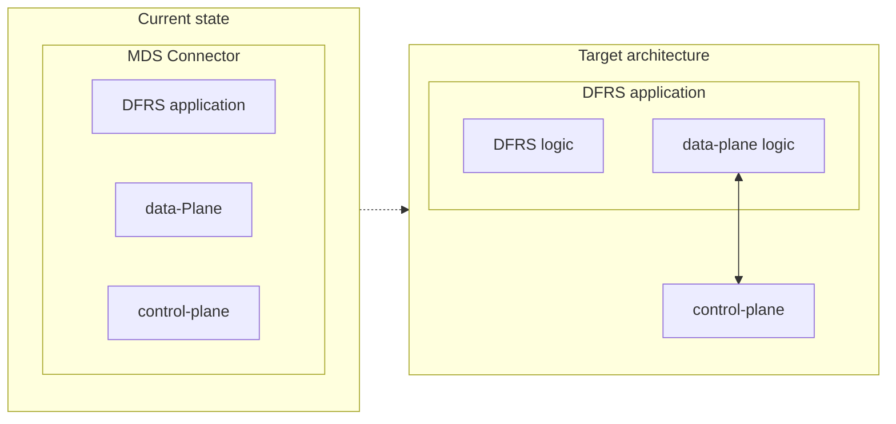

# Upgrade to EDC 1.0

EDC 1.0 is tentatively scheduled for September 2026. The project has undergone an extensive series of improvements and
is now ready to reach a stable, mature release.

> **Important:** 1.0 does not imply Long-Term Support. The release cadence remains approximately every 8 weeks, and
> only the latest release is guaranteed to be maintained — once 1.1.0 ships, 1.0.0 will no longer be supported.

Most of the new features described here are already available in 0.18.0. Version 1.0.0 will primarily be a cleanup
release, removing all deprecated APIs and modules. The MDS project can begin adapting now to ensure a smooth migration
when the final release lands.

## Table of Contents
<!-- TOC -->
* [Upgrade to EDC 1.0](#upgrade-to-edc-10)
  * [Table of Contents](#table-of-contents)
  * [1. Management API V4](#1-management-api-v4)
    * [Next Steps](#next-steps)
  * [2. Data Plane Signaling](#2-data-plane-signaling)
    * [Next Steps](#next-steps-1)
  * [3. EDC DataPlane Removal](#3-edc-dataplane-removal)
    * [Next Steps](#next-steps-2)
  * [4. CEL Expressions for Policy Functions](#4-cel-expressions-for-policy-functions)
    * [Next Steps](#next-steps-3)
  * [5. Virtual Connector](#5-virtual-connector)
    * [Next Steps](#next-steps-4)
<!-- TOC -->


## 1. Management API V4

As of v0.18.0, Management API V3 has been deprecated and V4 is now the active version. With v1.0.0, V3 will be
removed entirely. The motivation behind this migration is documented in the
[EDC blog post](https://eclipse-edc.github.io/blog/2026/02/19/management-api-upcoming-versions/).

### Next Steps
All clients interacting with MDS-EDC must migrate to API V4. In most cases this requires:
- Replacing `/v3/` with `/v4/` in the request path.
- Setting the correct JSON-LD `@context` in the request body (`https://w3id.org/edc/connector/management/v2`).
- Defining an MDS-specific JSON-LD context for the Management API to be used alongside the EDC one — this is required
  for correct expansion of semantic attributes during validation and storage.

## 2. Data Plane Signaling

EDC has adopted the [Data Plane Signaling specification](https://eclipse-dataplane-signaling.github.io/dataplane-signaling)
for communication between the control plane and the data plane. The previous EDC-specific protocol is deprecated and
will be removed in v1.0.0.

The most notable difference is that the `DataAddress` is no longer owned by the control plane — it is passed directly
to the data plane instead. Since the MDS connector embeds both planes, this is primarily an internal concern, but it
requires careful handling during migration.

### Next Steps
The most visible external change is the removal of the `Asset.dataAddress` attribute. It is loosely replaced by
`dataplaneMetadata`, which is not a direct equivalent but can be used to let the data plane reconstruct a `DataAddress`
from it. This approach can serve as a migration bridge for environments that relied on the control plane owning the
`DataAddress`.

A reference implementation for this pattern is available in
[this spike on the Tractus-X connector](https://github.com/wolf4ood/tractusx-edc/tree/feat/dps_spike). The embedded
architecture of the MDS connector should make this migration more straightforward.

EDC also provides a migration document that would help out this transition: https://eclipse-edc.github.io/blog/2026/05/19/data-plane-migration/

## 3. EDC DataPlane Removal

The EDC DataPlane modules have been removed from upstream. The reasoning is outlined in
[this blog post](https://eclipse-edc.github.io/blog/2026/01/19/data-plane-signaling/): the EDC team concluded that the
data plane is the layer requiring the most domain-specific logic and maintenance, and that the cleaner boundaries
introduced by the Data Plane Signaling spec made it the right moment to extract and delegate this responsibility
entirely to each use case.

### Next Steps
The immediate priority is to inherit the data plane codebase into the `mds-edc` repository. Beyond that, it is worth
auditing which transfer types are actually in use and trimming the implementation accordingly. For example, if DFRS
relies exclusively on Kafka-pull and HTTP-push, those two modes can be implemented cleanly and directly — avoiding the
complexity of the original "any source to any destination" generic model.

The diagram below illustrates a potential target architecture, where each use-case application owns its data plane
capabilities, and the control plane becomes a lean component focused solely on DSP and authentication.



## 4. CEL Expressions for Policy Functions

EDC 1.0 introduces [CEL (Common Expression Language)](https://eclipse-edc.github.io/documentation/for-adopters/control-plane/policy-engine/cel/)
as a declarative alternative to Java-based policy functions. Traditionally, evaluating an `AtomicConstraint` required
writing, compiling, and deploying a Java extension for each rule. With CEL, expressions are registered as data: a
`CelExpression` object pairs a left operand (an IRI) with a CEL expression string, and the policy engine evaluates it
at runtime — no code deployment required.

Expressions have access to the following runtime context:
- `ctx.agent` — counterparty identity and Verifiable Credentials
- `ctx.agreement` — contract details (available in transfer and monitor scopes)
- `this` — the ODRL constraint triple
- `now` — current timestamp

A companion extension provides chainable, null-safe helper functions for Verifiable Credential checks, for example:

```
ctx.agent.claims.vc.valid().withType('MembershipCredential').hasClaim('status', 'active')
```

Expressions also declare **scopes** (catalog, contract.negotiation, transfer.process, policy.monitor) to restrict which
policy evaluation phases they apply to.

### Next Steps
This feature is purely additive — no mandatory migration is required. However, existing Java policy functions,
especially credential-based ones, are strong candidates for replacement with CEL expressions. This is worth evaluating
as part of the 1.0 migration to reduce the policy extension surface area.

## 5. Virtual Connector

One of the most significant recent additions is the *virtual connector*, EDC's approach to multi-tenancy: a single EDC
runtime can serve multiple participants, potentially across multiple dataspaces.

### Next Steps
There is no mandatory action for `mds-edc`, but the deployment model is worth evaluating for the potential operational
advantages it could offer.
